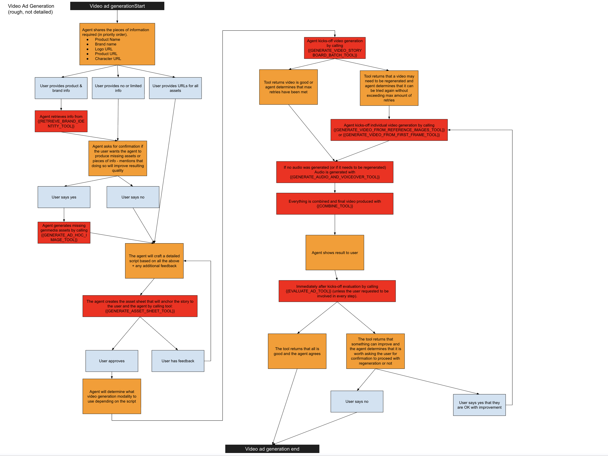

# Ad Generation Agent: System Architecture & LLM Context

> **PURPOSE:** This document serves as the absolute ground-truth architectural reference for the `ad_generation_agent`. It is explicitly designed to be read by Large Language Models (LLMs) to understand the system's design choices, structural conventions, constraints, and non-functional requirements (NFRs) *before* proposing or executing code changes.

---

## 1. System Overview & The Target Workflow

The Ad Generation Agent is a multi-modal creative orchestrator built on Google Cloud's Vertex AI (Gemini, Imagen 3, Veo 3.1). As depicted in the workflow diagram, the system enforces a strict state-machine logic designed to minimize hallucination, maximize brand fidelity, and optimize compute. Key aspects of this visual flow include:

1. **Information Gathering & Brand Discovery (`RETRIEVE_BRAND_IDENTITY_TOOL`)**: Fuzzy matches user input against a GCS catalog to pull canonical logos, product shots, and style guides perfectly into memory context (`BRAND_CONTEXT_PAYLOAD`).
2. **Asset Gap Fill**: The agent prompts the user to confirm generating missing generic assets (leveraging `GENERATE_AD_HOC_IMAGE_TOOL`).
3. **Narrative Construction (The Master Script)**: The LLM natively writes a detailed storyline script *before* generative tools are called. This acts as the unshakeable creative brief that prevents context drift.
4. **Visual Anchoring**: The agent calls `GENERATE_ASSET_SHEET_TOOL` to lock target character/prop visuals across scenes based on the script.
5. **Batch Generation**: The agent kicks off `GENERATE_VIDEO_STORYBOARD_BATCH_TOOL` to generate all video clips asynchronously in parallel.
6. **Agentic Single-Heal Loop**: A major architectural cornerstone. If the backend batch evaluates that a single scene critically needs regeneration (and exhausts its internal retries), it definitively fails. The *Agent* then manually takes over, executing a targeted heal on that specific scene via `GENERATE_VIDEO_FROM_REFERENCE_IMAGES_TOOL` or `GENERATE_VIDEO_FROM_FIRST_FRAME_TOOL`.
7. **Audio Caching Pipeline & Assembly**: The agent generates Audio (`GENERATE_AUDIO_AND_VOICEOVER_TOOL`). A critical aspect of the flow is that **audio is cached and reused** if the user triggers a regression loop (e.g., fixing Scene 2 visuals), saving massive compute. The combination step (`COMBINE_TOOL`) then merges the final MP4.
8. **Final Evaluation**: The agent runs a single, conclusive `EVALUATE_AD_TOOL` check against the flattened output. The workflow explicitly mandates that this evaluation happens *after* the combination step so the evaluator can holistically judge video pacing and audio sync. If it fails, it prompts the user for permission to restart the loop.

---

## 2. Directory & Structural Taxonomy
The codebase strictly distances the LLM's cognitive loop from the underlying infrastructure API calls.

*   `ad_generation_agent/prompt.md`: The brain. Contains the explicitly enumerated state-machine logic the agent uses to guide the user. It explicitly orders the agent to halt and ask for permission before moving between workflow stages.
*   `ad_generation_agent/agent.py`: Langchain/Vertex core setup orchestrating the `LlmAgent` initialization and registering the specific `FunctionTool` wrappers.
*   `ad_generation_agent/func_tools/`: Thin, LLM-facing function signatures. These files implement the distinct tools mapped in the workflow diagram (Batch Video, Single-Heal Video, Combine, Evaluate). `generate_video_storyboard_batch.py` handles parallelization (using `asyncio.gather`), while `generate_video.py` acts as the underlying engine handling retries and eval-loops.
*   `ad_generation_agent/utils/`: The deep implementation tier. Files like `video_generation.py` directly instantiate Vertex API clients, execute exponential backoffs, enforce duration rounding logic, and handle the native "LLM-as-a-Judge" evaluation loops.

---

## 3. Core Design Choices & Trade-offs

### A. The "Veo 3.1 Frame vs. Reference" Dichotomy (CRITICAL)
Google's Veo 3.1 model has disparate endpoint behaviors depending on the payload arrays. To reduce LLM cognitive load while navigating these differences, we use a **Unified Batch Router** pattern (`GENERATE_VIDEO_STORYBOARD_BATCH_TOOL`):

1.  **The `generation_modality` Switch**: 
    *   The LLM dictates the video generation style per scene within the single `storyboard_json` payload.
    *   The Python backend dynamically parses this and routes to the appropriate asynchronous wrapper.
2.  **Modality 1: First-Frame (`first_frame`)**: 
    *   **Advantage:** Supports flexible durations (4s, 6s, 8s), precise spatial control, and highly dynamic cinematic movements. Mandatory for pure Logo scenes.
    *   **Trade-off:** Minimal inherent brand fidelity across frames. Relies strictly on the starting image.
3.  **Modality 2: Reference-Images (`reference_images`)**:
    *   **Advantage:** Unlocks the "Unified Reference Protocol"—injecting the Logo, Product Image, and Asset Sheet directly into the video backbone for ironclad brand adherence. Mandatory for "Hero" product shots.
    *   **Constraint (Strict Option B Escalation):** Veo 3.1 `reference_to_video` **requires exactly an 8-second generation duration**. If the LLM requests this modality with a different duration (e.g., 4s), the backend intercepts the thread and throws a soft Markdown error directly back to the orchestrator. This explicitly forces an internal self-correction loop where the LLM must rewrite the offending JSON payload and adjust its math.

### B. High-Concurrency vs. Rate Limiting (The Semaphore Pattern)
Because an ad storyboard might contain 6-10 scenes, generating media serially would cause painful UX delays.
*   **Design Choice:** Batch tools (`generate_storyboard_image_batch`, `generate_storyboard_video_batch`) parse the full JSON payload and launch ALL scenes simultaneously using `asyncio.gather`.
*   **Protection:** We inject `asyncio.Semaphore` (driven by `IMAGE_GENERATION_CONCURRENCY_LIMIT` / `VIDEO_...`) directly into the utility clients to mathematically prevent the parallel executions from triggering Vertex AI API Quota Limits (HTTP 429 errors).

### C. Self-Healing Media Generation ("LLM-as-a-Judge")
Visual generation is inherently stochastic and prone to prompt deviations. 
*   **Mechanism:** Rather than surfacing hallucinated or malformed media immediately to the user, the `utils` layer can optionally intercept the generated bytes, pass them alongside the original prompt to a specialized Gemini Evaluation Model, and score the output (Fail/Pass).
*   **The Loop:** If it fails, the Evaluator generates a "Fix Prompt" (e.g., "Add more lighting to the product"). The code automatically intercepts this, appends it to the original payload (`CRITICAL FIXES NEEDED OVER PREVIOUS ATTEMPT:`), and restarts generator API silently.
*   **Trade-off:** Massive increase to average generation latency (Wait times) traded off for a dramatic increase in ultimate media quality and prompt adherence.

### D. Parameter Omission vs Context Enforcement
The system tools intentionally mark brand parameters (like `logo_image_url`) as "Optional" in their code signatures. 
*   **Why?** Because the user might just want a generic video.
*   **The Catch:** The `prompt.md` includes a "CRITICAL MANDATE" explicitly overriding this: *If the system memory has identified a logo or product image during the Brand Discovery phase, the LLM is forcibly required to inject that parameter into the tool call.* This achieves "Magic Context" injection without crashing the tool if the context genuinely doesn't exist.

### E. JSON String Payload Serialization vs Structured OpenAPI
The batch-generation tools (`generate_storyboard_image_batch` and `generate_storyboard_video_batch`) intentionally request their entire payload as a single raw `storyboard_json` **string**, rather than deeply nested native array structures.
*   **Why?** Standard LLM tool-calling architectures often aggressively throttle or fail to parse extremely deep, dynamic schemas (like a 10-scene ad with branching parameters and reference arrays).
*   **The Trade-off:** By defining the input as a single `string` containing JSON, we force the LLM to serialize the entire payload internally and bypass strict OpenAPI parameter depth limits. The underlying Python code simply calls `json.loads(storyboard_json)` and immediately benefits from dynamic array sizes for arbitrarily large commercials.

### F. Aesthetic Constraints & Photorealism Enforcement
Modern image generation models occasionally default to illustrations, 3D renders, or cartoonish outputs depending on their internal routing or minor keywords in the prompt.
*   **Design Choice:** To enforce a premium, commercial aesthetic across the entire application, an `AESTHETICS (CRITICAL)` constraint is hardcoded directly into the Python layer of every generation tool (`generate_asset_sheet.py`, `generate_ad_hoc_image.py`, `generate_scene_frame.py`, `generate_display_ad.py`).
*   **Mechanism:** Just before the prompt payload is sent to the Vertex AI API, the string `Unless explicitly requested otherwise (e.g., cartoon, illustration, 3d render), the image MUST be a hyperrealistic, photorealistic photograph.` is forcefully appended. This ensures the output remains photorealistic by default, while allowing the orchestrating LLM to explicitly override it if a user *actually* requests an animated or illustrated ad.

---

## 4. The Native Agent "Evaluation Loop"
Because text-to-image and text-to-video models hallucinate, this agent intercepts raw byte streams *before* returning success to the LLM orchestrator.

### The Grader: `evaluate_media.py`
Every generated media asset is piped to `LLM_GEMINI_MODEL_EVALUATION` (typically Gemini 2.5 Pro/Flash) for a unified score out of 10.0, judged purely against the original text prompt.
The Gemini evaluator maps its judgment into a strict `EvalResult` schema evaluating 5 intrinsic criteria:
1.  **Subject & Brand:** Does the asset visually adhere to the provided reference images?
2.  **Physics & Logic:** Are there bizarre physics violations (e.g., extra fingers, floating objects)?
3.  **Visual Fidelity:** Is the resolution crisp, and the style cohesive?
4.  **Temporal Flow:** (Video only) Is the motion smooth and logical without catastrophic generation morphing?
5.  **Consistency:** Does it match the explicitly requested storyline?

**Self-Healing Implementation (The Backend vs Agentic Split):**
The codebase deliberately bifurcates retry responsibilities to balance token costs against deterministic state management:
1. **The Backend Retry (Invisible to Agent):** When `generate_video.py` calls the Veo API and the resulting video violently breaches physical logic (evaluated by Gemini), the Python code triggers an internal `while` loop. It appends the evaluator's "fix" request to the prompt and retries the Veo API silently, decrementing `VIDEO_GENERATION_TENACITY_ATTEMPTS`. The Orchestrator LLM is completely unaware of this loop, saving massive wait delays and input tokens.
2. **The Agentic Retry (Visible to LLM):** If the *Backend Retry* exhausts its internal counter without achieving a "Pass" score, it breaks the loop and forcefully returns a `Failed` signal back up the chain to the Orchestrator. At this point, the state-machine protocol kicks in: The Agent acknowledges the failure to the user, formulates a new text plan, and explicitly calls the singular `GENERATE_VIDEO_FROM_FIRST_FRAME_TOOL` (or reference tool) to orchestrate a manual heal on that specific scene.

### Unit Testing & Trajectory Verification (`test_evals.py`)
To prevent configuration drift from breaking the complex Orchestrator state-machine, the agent employs deterministic ADK `AgentEvaluator` assertions. 
*   **The Directory Rule:** All agent evaluation configuration JSONs (e.g. `test_config.json`, `*.test.json`) *must* be kept in a single top-level `/evals` directory alongside the unified script (e.g., `ad_generation_agent/evals/`). **Do not** create nested `evals/` folders deeper in the package hierarchy (e.g., `ad_generation_agent/ad_generation_agent/evals/` is strictly forbidden).
*   **The Problem:** LLM testing environments frequently suffer from file proliferation (e.g., separate scratchpads, PyTest hooks, and debug loggers).
*   **The Solution:** Evaluation execution is strictly unified under a single entry point: `test_evals.py`.
*   **Mechanism:** This script implements a Dual-Mode execution pattern. When triggered by automated CI/CD runners (via `pytest`), it fires a global suite execution. When triggered manually via CLI (via `python test_evals.py [path]`), it intercepts the standard output, captures the highly verbose interaction matrices and trace telemetry, and cleanly routes the debug payload to timestamped text files inside the heavily `.gitignore`d `eval_results/` directory.

---

## 5. Non-Functional Requirements (NFRs)
1.  **Stateless Crash Resilience:** All generated artifacts (Images, Videos) are simultaneously streamed to Google Cloud Storage (GCS) and saved to disk. All URIs returned back to the LLM are canonical `gs://` links. This ensures the LLM's context window can be perfectly restored or continued later without losing access to the heavy binary media payloads.
2.  **Robust Async Throttling (`Tenacity`):** The underlying API calls must use exponential backoff retries (`@retry(...)`) tuned specifically for standard multi-modal Vertex generation failure profiles.

## 6. Deployment & Configuration Matrix
This agent follows the **ADK Decentralized Deployment Pattern**. Its operating parameters are defined in specific JSON files within `deployment_config/` (e.g., `prod-3.20260119.1.json` or `staging-4.20260219.1.json`). 
*   **The Mapping Rule (CRITICAL):** Whenever new environment variables (like `VIDEO_GENERATION_CONCURRENCY_LIMIT`) are introduced to the core logic, they MUST be identically mapped into all relevant staging/prod JSON config matrices. This ensures perfect runtime parity in the Cloud Reasoning Engine environments where the overarching `marketing_orchestrator` relies on these JSONs to hydrate the Cloud Run application.

---

## 7. Historical Decisions & Refactoring Context (March 2026)
This section preserves the critical context, debates, and trade-offs made during the massive Veo 3.1 / V2 Orchestration refactor to ensure future AI agents understand *why* the code is written this way.

### A. The Post-Combine Evaluation Debate
*   **The Proposal:** An initial proposal suggested running the final `EVALUATE_AD_TOOL` *before* the `COMBINE_TOOL` (audio + video merge). The argument was that evaluating an assembled MP4, failing it, and looping back would waste the compute spent on generating the Audio track.
*   **The Rejection & Final Decision:** This was explicitly rejected by the user. The final evaluation MUST happen *after* the Combine step. 
*   **The Rationale (Pros):** The evaluation LLM needs to see the *entire* video, including the audio pacing, to provide an accurate, holistic judgment. 
*   **The Mitigation (Handling Cons):** To mitigate the compute waste of throwing away audio during regression loops, a strict **Audio Caching** rule was explicitly baked into the Orchestrator's `prompt.md`. If the user loops back to heal a video scene, the Agent is instructed to skip audio generation and reuse the existing valid audio track for the new synthesis.

### B. The Death of the "Image Storyboard" 
*   **The Pivot:** Early agent versions relied heavily on generating a static image storyboard (`GENERATE_STORYBOARD_IMAGE_BATCH_TOOL`) before animating. 
*   **The Decision:** With the introduction of Veo 3.1's robust `reference_images` support, generating static seed frames became largely obsolete and doubled the wait time. 
*   **The Outcome:** The Image Storyboard step was entirely stripped from the standard prompt workflow. The agent now moves directly from Script -> Asset Sheet (`GENERATE_ASSET_SHEET_TOOL`) -> Video Batch. This significantly reduced LLM cognitive load and token bloat.

### C. Strict Scene Consistency vs. Loose Demographic Matching
*   **The Problem:** Initial test runs revealed highly chaotic video outputs where camera angles cut erratically within a single 4-second clip, and the "Hero" actor's face/wardrobe drifted noticeably between scenes because the evaluation agents were too lenient.
*   **The Solution:** 
    1.  **Anti-Cut Mandates:** Explicit "Single Action Rules" (NO montages, NO camera cuts within a clip) were injected natively into the `video_director_enhancement_prompt.md`.
    2.  **Pedantic Identity Checks:** The `video_evaluation_prompt.md` was rewritten to demand *pixel-perfect* replication. Evaluators are now instructed to aggressively FAIL a video if the wardrobe or facial structure deviates even slightly from the Asset Sheet, rather than accepting "similar" demographic matches.

### D. Multi-Product Brand Context Optimization
*   **The Problem:** Feeding the LLM the entire corporate brand catalog for a single query blew up the context window.
*   **The Decision:** Instead of hardcoding product logic, `retrieve_brand_identity.py` was refactored with Python `difflib`. It fuzzy matches the user's `product_name` against the GCS catalog, extracts *only* that specific product's data, prunes the massive `products` array from the payload, and hands the optimized, lightweight JSON to the Orchestrator. 

### E. Native Aspect Ratio Plumbing & Strict Portrait Defaults
*   **The Problem:** Earlier iterations hardcoded `aspect_ratio` defaults deep in the `utils` layer, while the LLM was improperly prompted to make a "judgment call" on whether a prompt sounded like it needed landscape or portrait. This led to hallucinated mismatched aspect ratios across generated images and videos that would break the final `combine_video` flow.
*   **The Decision:** We surfaced the `aspect_ratio` variable natively up to the Orchestrator's Batch JSON array configuration. However, we explicitly stripped the LLM of its autonomous "judgment call" permission. The strict rule now dictates: The agent MUST default to the `VIDEO_DEFAULT_ASPECT_RATIO` and `IMAGE_DEFAULT_ASPECT_RATIO` (Portrait, 9:16) by omitting the parameter entirely from the API call, *unless* the user explicitly types the words "landscape", "square", "16:9", etc. into their prompt. This ensures 100% consistency downstream while remaining dynamically overridable.

### F. Pre-Flight Duration Validation (The "ShowableException" pattern)
*   **The Problem:** If the LLM suffered from poor math and requested a `first_frame` video of 7 seconds, Veo 3.1 would reject it 30 seconds later, wasting time and triggering a messy unhandled exception.
*   **The Decision:** The Python backend (`generate_video.py`) now intercepts the LLM's JSON payload *before* making any API network calls. If the duration constraints (4s, 6s, 8s for `first_frame`, or strictly `8s` for `reference_images`) are violated, it immediately raises a custom `ShowableException` that cleanly returns the math error string directly into the LLM's chat context, forcing it to rewrite the JSON.

### G. Pedantic Script Headers Strategy
*   **The Problem:** "Context drift" where the LLM forgets the overarching commercial objective by Scene 3.
*   **The Decision:** We established a strict structural format in the Orchestrator's `prompt.md`. Before calling any batch generation tools, the LLM MUST generate a script with explicit Markdown Headers (`Purpose/Objective`, `Alignment with Guidelines`, and `Global Persistent Visuals`). The `prompt.md` explicitly mandates that the entirety of these headers are passed verbatim into the downstream video tools, ensuring the Veo models are constantly grounded in the global context.

